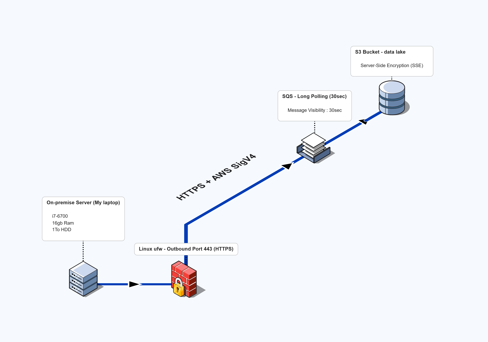

# MLOps Project : Tickets Sorter 

##  Network Design ( Hybrid Cloud)

## Worflow 
- Trunk-Basedd Development (tbd) : tbdflow tool 
    --> Personne ne peut commit directement sur la branche trunk 
    --> Chacun doit créer une branche courte (<4h) puis faire une PR
- uv --> Packaged App (Géré par Astral)

### Linting 
- Python :  (aussi géré par Astral)
- YAML : yamlint